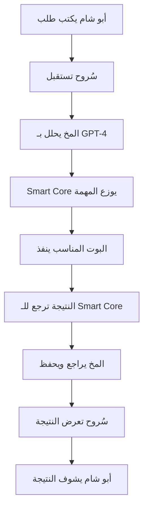

# 🧠 منظومة سُروح الذكية - المواصفات الفنية الشاملة
## **مستند تقني احترافي للمطورين**

---

## 🎯 **نظرة عامة على المشروع**

### **اسم المشروع:** منظومة سُروح الذكية
### **العميل:** أبو شام (Sam Borvat) - مجموعة سُروح القابضة  
### **الرؤية:** بناء نظام ذكي متكامل يعمل كمساعد شخصي ذكي وسكرتيرة متطورة
### **الهدف:** نواة مركزية ذكية تدير كل الأعمال والمشاريع الرقمية

---

## 🏗️ **الهيكل المعماري للنظام**

### **العمارة الإجمالية:**
```
[أبو شام] ↔ [سُروح الواجهة] ↔ [المخ المتطور] ↔ [Smart Core] ↔ [4 بوتات ذكية]
```

### **المكونات الرئيسية الخمسة:**

#### **1. 👩‍💼 سُروح - الواجهة الذكية (Frontend)**
- **التقنية:** React 19 + Next.js 14 + Tailwind CSS
- **النوع:** Progressive Web App (PWA)
- **الوظيفة:** واجهة المستخدم الأساسية والتفاعل الذكي

#### **2. 🧠 المخ المتطور - النواة المركزية (Core Brain)**
- **التقنية:** Python 3.11 + FastAPI + Vector Database
- **الذكاء:** GPT-4 + Embeddings + RAG (Retrieval Augmented Generation)
- **الوظيفة:** معالجة ذكية، ذاكرة طويلة المدى، اتخاذ قرارات

#### **3. ⚙️ Smart Core - منسق المهام (Task Orchestrator)**
- **التقنية:** Python + FastAPI + Queue System
- **الذكاء:** GPT-4 للتحليل وتوزيع المهام
- **الوظيفة:** تحليل المهام وتوزيعها على البوتات المناسبة

#### **4. 🤖 البوتات الذكية المتخصصة (Intelligent Agents)**
- **العدد:** 4 بوتات أساسية + قابلية إنشاء بوتات جديدة
- **التقنية:** Python + FastAPI + OpenAI APIs
- **الذكاء:** كل بوت مربوط بـ GPT-4 + تخصص محدد

#### **5. 💾 نظام البيانات (Data Layer)**
- **قاعدة البيانات:** MongoDB + Redis للـ Caching
- **التخزين:** MinIO أو AWS S3 للملفات
- **البحث:** Elasticsearch أو Vector Database

---

## 🤖 **البوتات الذكية المطلوبة**

### **البوتات الأساسية الأربعة:**

#### **1. 👨‍💻 Code Master - المبرمج الذكي**
- **التخصص:** البرمجة والتطوير
- **التقنيات:** Python, JavaScript, React, FastAPI, MongoDB
- **القدرات الذكية:**
  - كتابة كود احترافي بـ GPT-4
  - مراجعة وتحسين الكود
  - إنشاء APIs جديدة
  - إنشاء بوتات جديدة عند الطلب
  - تطوير ذاتي مستمر
- **ربط الذكاء:** GPT-4o للكود، GitHub Copilot للمساعدة
- **المدخلات:** وصف المهمة، متطلبات تقنية
- **المخرجات:** كود كامل، documentation، اختبارات

#### **2. 🎨 Design Genius - المصمم الذكي**
- **التخصص:** التصميم والإبداع البصري
- **التقنيات:** DALL-E 3, Midjourney, Figma APIs, Adobe Creative Cloud
- **القدرات الذكية:**
  - تحليل متطلبات التصميم بـ GPT-4
  - توليد صور بـ DALL-E 3
  - إنشاء واجهات UI/UX
  - تطوير الهوية البصرية
  - مكتبة تصاميم منظمة
- **ربط الذكاء:** GPT-4 + DALL-E 3 + تحليل الألوان والأشكال
- **المدخلات:** وصف التصميم، الألوان المفضلة، النمط
- **المخرجات:** صور عالية الجودة، ملفات التصميم، دليل الاستخدام

#### **3. 🏗️ Full-Stack Pro - بوت التطوير المتكامل**
- **التخصص:** التطوير الشامل وإدارة النظام
- **التقنيات:** Full-Stack Development, DevOps, Cloud, Database Management
- **القدرات الذكية:**
  - تفكير استراتيجي عميق
  - تحليل المخاطر المتقدم
  - اتخاذ قرارات معمارية
  - تطوير أنظمة معقدة
  - طلب موافقة المخ للتغييرات الحساسة
- **ربط الذكاء:** GPT-4 Advanced + تحليل مخاطر + تخطيط استراتيجي
- **المدخلات:** متطلبات النظام، constraints، أهداف الأداء
- **المخرجات:** architecture، كود متكامل، خطة النشر، documentations

#### **4. 🌐 Account Manager - مدير الحسابات والمواقع**
- **التخصص:** إدارة الحسابات الرقمية والمواقع الإلكترونية
- **التقنيات:** Web APIs, OAuth, Database Management, Analytics
- **القدرات الذكية:**
  - مراقبة المواقع الحية (uptime, performance)
  - إدارة حسابات متعددة (Gmail, BOL, Amazon, إلخ)
  - تحليل أمان الحسابات
  - تحليل أداء المبيعات والإحصائيات
  - اقتراحات تحسين ذكية
- **ربط الذكاء:** GPT-4 + Web Analytics + تحليل البيانات
- **المدخلات:** credentials الحسابات، المواقع للمراقبة
- **المخرجات:** تقارير دورية، تنبيهات، اقتراحات تحسين

---

## 🧠 **المخ المتطور - المواصفات التفصيلية**

### **Architecture Pattern:**
```
API Gateway → Authentication → Request Processor → AI Engine → Response Generator
     ↓              ↓                ↓               ↓            ↓
Rate Limiting → JWT/OAuth2 → Task Analysis → GPT-4 → Intelligent Response
```

### **المكونات الفرعية:**

#### **🔐 API Gateway:**
- **Rate Limiting:** 1000 requests/hour per user
- **Authentication:** JWT tokens + OAuth2 for external services
- **Security:** Input validation, XSS protection, CORS handling

#### **🧠 AI Processing Engine:**
- **LLM Integration:** GPT-4o-mini للتحليل السريع، GPT-4 للمهام المعقدة
- **Vector Database:** Qdrant أو Pinecone لـ Semantic Search
- **Memory System:** طويلة المدى مع embeddings للسياق
- **Decision Making:** نظام قرارات ذكي مع confidence scoring

#### **📊 Memory Management:**
- **Session Management:** Redis للجلسات النشطة
- **Long-term Memory:** Vector embeddings للمحادثات والوثائق
- **Context Retention:** آخر 50 تفاعل مع السياق الكامل
- **Knowledge Base:** تخزين وفهرسة كل المعلومات المهمة

---

## ⚙️ **Smart Core - مواصفات منسق المهام**

### **Core Functions:**
1. **Task Analysis:** تحليل نوع المهمة وتعقيدها
2. **Bot Selection:** اختيار أفضل بوت للمهمة
3. **Load Balancing:** توزيع المهام حسب capacity البوتات
4. **Progress Monitoring:** متابعة تقدم المهام
5. **Result Aggregation:** جمع وتنظيم النتائج

### **Intelligence Layer:**
- **Task Classification:** GPT-4 لتصنيف المهام
- **Priority Assessment:** تقييم أولوية المهام تلقائياً
- **Resource Optimization:** استخدام البوتات بكفاءة أمثل
- **Error Recovery:** إعادة المحاولة الذكية في حالة الفشل

---

## 📱 **Frontend - مواصفات سُروح الواجهة**

### **التصميم المطلوب:**
- **Style:** ChatGPT-inspired مع لمسة عربية
- **Layout:** Sidebar للدردشات + Main chat area + Status indicators
- **Responsive:** يعمل على كل الأجهزة (Desktop, Tablet, Mobile)
- **Dark Mode:** تبديل بين الوضع الفاتح والداكن

### **المكونات المطلوبة:**

#### **🎛️ Dashboard Pro:**
- **6 بطاقات إحصائيات حية:** المخ، Smart Core، البوتات، CPU، RAM، Network
- **4 تبويبات رئيسية:** Dashboard، APIs، Services، Tasks
- **Navigation Cards:** بطاقات قابلة للضغط لفتح صفحات مخصصة
- **Real-time Updates:** تحديث تلقائي كل 10 ثوان
- **Multi-language:** دعم العربية والإنجليزية

#### **💬 سُروح Chat Interface:**
- **ChatGPT Style:** Sidebar + Message area + Input field
- **Project Management:** قائمة المشاريع والدردشات السابقة
- **Message Types:** تمييز رسائل المستخدم والمساعد
- **Typing Indicators:** مؤشر الكتابة أثناء المعالجة
- **Message History:** حفظ واسترجاع المحادثات

---

## 🔗 **التكاملات الخارجية المطلوبة**

### **الخدمات الأساسية:**

#### **📧 Gmail Integration:**
- **IMAP/SMTP:** قراءة وإرسال الإيميلات
- **OAuth2:** مصادقة آمنة
- **Features:** فلترة، بحث، تصنيف تلقائي، ردود ذكية

#### **🐙 GitHub Integration:**
- **GitHub API v4:** إدارة المستودعات
- **Auto-deployment:** رفع الكود تلقائياً
- **Version Control:** تتبع التغييرات والإصدارات
- **Collaboration:** إدارة Pull Requests والـ Issues

#### **🛒 E-commerce Platforms:**
- **BOL.com API:** إدارة المتجر الهولندي
- **Amazon SP-API:** إدارة متجر أمازون  
- **Shopify API:** إدارة متاجر Shopify
- **Features:** مراقبة المبيعات، إدارة المخزون، تحليل الأداء

#### **💰 Payment Systems:**
- **Stripe API:** معالجة المدفوعات
- **PayPal API:** دعم PayPal
- **Bank APIs:** ربط الحسابات المصرفية

---

## 🧠 **متطلبات الذكاء الاصطناعي**

### **LLM Integration:**
- **Primary:** OpenAI GPT-4o-mini + GPT-4
- **Backup:** Claude-3.5-Sonnet أو Gemini Pro
- **Specialized:** DALL-E 3 للصور، Whisper للصوت

### **AI Capabilities Required:**

#### **🔍 Natural Language Processing:**
- فهم اللغة العربية والإنجليزية
- تحليل المشاعر والنوايا
- استخراج المعلومات من النصوص
- ترجمة ذكية بين اللغات

#### **🎯 Decision Making:**
- تحليل المخاطر
- تقييم الخيارات المتاحة
- اتخاذ قرارات بناء على السياق
- طلب الموافقة للقرارات الحساسة

#### **📚 Learning & Memory:**
- تعلم من كل تفاعل
- حفظ التفضيلات والأنماط
- بناء knowledge base شخصية
- تحسين الأداء بناء على الخبرة

---

## 🛠️ **المتطلبات التقنية التفصيلية**

### **Backend Requirements:**

#### **🖥️ Server Infrastructure:**
- **Language:** Python 3.11+
- **Framework:** FastAPI 0.104+
- **WebSocket:** للتحديثات المباشرة
- **Background Tasks:** Celery + Redis
- **API Documentation:** OpenAPI/Swagger

#### **💾 Database Layer:**
- **Primary DB:** MongoDB 6.0+ (NoSQL للمرونة)
- **Vector DB:** Qdrant أو Pinecone (للـ AI embeddings)  
- **Cache:** Redis 7.0+ (للجلسات والـ caching)
- **Search:** Elasticsearch (للبحث النصي المتقدم)

#### **🔒 Security & Authentication:**
- **JWT Tokens:** للمصادقة
- **OAuth2:** للخدمات الخارجية
- **Rate Limiting:** لحماية APIs
- **Data Encryption:** AES-256 للبيانات الحساسة
- **API Keys Management:** نظام إدارة مفاتيح آمن

### **Frontend Requirements:**

#### **⚡ Performance:**
- **Bundle Size:** < 500KB compressed
- **First Load:** < 3 seconds
- **Subsequent Loads:** < 1 second
- **Real-time Updates:** WebSocket connections

#### **📱 Responsive Design:**
- **Desktop:** 1920x1080 optimized
- **Tablet:** 768px breakpoint
- **Mobile:** 375px minimum width
- **Touch-friendly:** 44px minimum touch targets

---

## 🔄 **التدفق المطلوب (User Flow)**

### **السيناريو النموذجي:**


### **أمثلة على التدفق:**

#### **مثال 1 - طلب تصميم:**
1. أبو شام: "بدي شعار لشركة سُروح"
2. سُروح: "فهمت، أرسل للمخ للتحليل"
3. المخ: "طلب تصميم - ثقة 95% - إرسال للمصمم"
4. Smart Core: "توجيه للـ Design Genius"
5. Design Genius: "تحليل + إنشاء بـ DALL-E 3"
6. النتيجة: صورة شعار + شرح + حفظ في مكتبة
7. سُروح: "تم الانتهاء! إليك الشعار"

#### **مثال 2 - طلب برمجة:**
1. أبو شام: "بدي موقع تجاري"
2. سُروح: "مفهوم، تحليل المتطلبات"
3. المخ: "مشروع تطوير - complexity عالي - multi-bot task"
4. Smart Core: "Design Genius للواجهة + Code Master للكود + Full-Stack Pro للدمج"
5. البوتات: "تنفيذ بالتوازي مع تنسيق"
6. النتيجة: موقع كامل مع كود + تصميم + database
7. سُروح: "الموقع جاهز مع كل التفاصيل!"

---

## 📊 **مؤشرات الأداء المطلوبة (KPIs)**

### **Response Time:**
- **سُروح Response:** < 2 ثانية
- **AI Processing:** < 5 ثوان للمهام البسيطة
- **Complex Tasks:** < 30 ثانية للمهام المعقدة

### **Accuracy:**
- **Language Understanding:** > 95%
- **Task Classification:** > 90%
- **Bot Selection:** > 85% صحيح

### **Reliability:**
- **Uptime:** 99.9%
- **Error Rate:** < 1%
- **Data Loss:** 0%

---

## 🔧 **متطلبات التطوير للمبرمج**

### **المهارات الأساسية المطلوبة:**

#### **🖥️ Backend Development:**
- **Python:** خبرة متقدمة 5+ سنوات
- **FastAPI/Flask:** بناء APIs متطورة
- **MongoDB:** NoSQL database design وoptimization
- **Redis:** Caching وsession management
- **WebSockets:** Real-time communications

#### **🤖 AI/ML Integration:**
- **OpenAI APIs:** GPT-4, DALL-E 3, Embeddings
- **Vector Databases:** Qdrant, Pinecone, أو Weaviate
- **RAG Systems:** Retrieval Augmented Generation
- **NLP Libraries:** spaCy, NLTK للنصوص العربية
- **Machine Learning:** scikit-learn, TensorFlow/PyTorch (optional)

#### **📱 Frontend Development:**
- **React/Next.js:** خبرة متقدمة
- **TypeScript:** Strong typing
- **Tailwind CSS:** Utility-first CSS
- **State Management:** Zustand أو Redux Toolkit
- **Real-time UI:** WebSocket integration

#### **☁️ DevOps & Infrastructure:**
- **Docker:** Containerization
- **Kubernetes:** Orchestration (اختياري)
- **CI/CD:** GitHub Actions أو GitLab CI
- **Monitoring:** Prometheus + Grafana
- **Logging:** ELK Stack أو Loki

### **الخبرة المطلوبة:**
- **سنوات الخبرة:** 5-8 سنوات في تطوير الأنظمة المعقدة
- **AI Integration:** خبرة في ربط LLMs مع التطبيقات
- **Arabic Language:** فهم طبيعة اللغة العربية والمحتوى
- **Enterprise Systems:** خبرة في الأنظمة الكبيرة والمعقدة

---

## 📋 **وصف العمل (Job Description)**

### **Job Title:** Senior Full-Stack AI Developer - نظام سُروح الذكي

### **المسؤوليات الأساسية:**
1. **تطوير المخ المتطور** مع GPT-4 integration
2. **بناء Smart Core** لتوزيع المهام الذكي
3. **تطوير البوتات الأربعة** كل واحد بتخصصه
4. **إنشاء Dashboard احترافي** مع real-time data
5. **بناء سُروح Chat Interface** بنمط ChatGPT
6. **تكامل الخدمات الخارجية** (Gmail, GitHub, E-commerce)
7. **نظام الأمان والحماية** المتقدم
8. **Documentation وTesting** شامل

### **التحديات التقنية:**
- **Real-time Processing:** معالجة فورية للطلبات
- **Multi-language Support:** عربي + إنجليزي
- **Complex Integrations:** ربط خدمات متنوعة
- **AI Coordination:** تنسيق عدة AI models
- **Scale Planning:** النظام قابل للتوسع

### **Deliverables:**
1. **Working System:** نظام كامل يعمل
2. **Clean Code:** كود منظم وموثق
3. **API Documentation:** توثيق شامل لكل endpoint
4. **Testing Suite:** اختبارات automated
5. **Deployment Guide:** دليل النشر والتشغيل
6. **User Manual:** دليل الاستخدام لأبو شام

---

## 💰 **تقدير الجهد والوقت**

### **Timeline المتوقع:**

#### **Phase 1 (2-3 أسابيع):** Core Infrastructure
- Backend APIs base
- Database setup
- Authentication system
- Basic frontend structure

#### **Phase 2 (3-4 أسابيع):** AI Integration
- GPT-4 integration
- Vector database setup
- Basic bot framework
- Smart Core foundation

#### **Phase 3 (3-4 أسابيع):** Intelligent Bots
- 4 specialized bots development
- Task routing system
- Inter-bot communication
- Advanced AI features

#### **Phase 4 (2-3 أسابيع):** Frontend Excellence
- Professional Dashboard Pro
- Surooh Chat Interface
- Real-time updates
- Mobile responsiveness

#### **Phase 5 (2 أسابيع):** Integration & Testing
- End-to-end testing
- Performance optimization
- Security hardening
- Documentation

### **إجمالي الوقت:** 12-16 أسبوع (3-4 أشهر)

---

## 🎯 **معايير النجاح**

### **Functional Requirements:**
- [ ] سُروح ترد على الأسئلة بذكاء وطبيعية
- [ ] البوتات تنفذ المهام المتخصصة بدقة
- [ ] التكامل مع Gmail وGitHub يعمل بسلاسة
- [ ] Dashboard يعرض بيانات حقيقية ومفيدة
- [ ] النظام يتعلم ويتحسن مع الاستخدام

### **Non-Functional Requirements:**
- [ ] Response time < 3 seconds للمهام البسيطة
- [ ] 99% uptime
- [ ] يدعم 100+ concurrent users
- [ ] Mobile responsive
- [ ] Arabic language support كامل

### **Business Requirements:**
- [ ] يوفر الوقت لأبو شام في إدارة الأعمال
- [ ] يحسن كفاءة العمليات التجارية
- [ ] يقدم insights مفيدة للقرارات
- [ ] قابل للتوسع مع نمو الأعمال

---

## 🔐 **متطلبات الأمان**

### **Data Protection:**
- **Encryption:** كل البيانات مشفرة at-rest وin-transit
- **Privacy:** لا يتم مشاركة بيانات أبو شام مع أطراف ثالثة
- **Backup:** نسخ احتياطية يومية مشفرة
- **Access Control:** صلاحيات محددة لكل مكون

### **API Security:**
- **Authentication:** كل API call مصادق عليه
- **Rate Limiting:** لمنع abuse
- **Input Validation:** فحص كل المدخلات
- **Audit Logging:** تسجيل كل العمليات الحساسة

---

## 📞 **معلومات الاتصال والدعم**

### **العميل:**
- **الاسم:** أبو شام (Sam Borvat)
- **الشركة:** مجموعة سُروح القابضة
- **العلامة التجارية:** BORVAT®
- **الشعار:** "لا شيء مستحيل – زنبق صخر الصوان"

### **متطلبات التواصل:**
- **تقارير أسبوعية** عن التقدم
- **Demo sessions** كل أسبوعين
- **Code reviews** مع أبو شام
- **Technical documentation** باللغة العربية

---

## 🚀 **الخطوات التالية**

### **للمطور المهتم:**
1. **مراجعة هذا المستند** بالكامل
2. **تقدير الوقت والتكلفة** المطلوبة
3. **اقتراح التقنيات** المناسبة
4. **وضع خطة زمنية** مفصلة
5. **تحديد المتطلبات الإضافية** إذا وجدت

### **معايير اختيار المطور:**
- **Portfolio قوي** في AI/ML applications
- **خبرة Enterprise systems** 
- **فهم الثقافة العربية** والمحتوى
- **Communication skills** ممتازة
- **Problem-solving abilities** متقدمة

---

## 📈 **العائد المتوقع للاستثمار**

### **الفوائد المباشرة:**
- **توفير 20+ ساعة أسبوعياً** لأبو شام
- **تحسين كفاءة العمليات بـ 40%**
- **زيادة دقة القرارات** مع AI insights
- **أتمتة المهام المتكررة** 100%

### **الفوائد طويلة المدى:**
- **Competitive advantage** في السوق
- **Scalability** مع نمو الأعمال  
- **Data-driven decisions** مع analytics
- **Brand differentiation** مع التقنية المتقدمة

---

**🎯 هذا مشروع نواة تقنية متقدمة يحتاج مطور خبير ومتخصص في AI وEnterprise systems**

**📧 للاستفسارات التقنية:** [اتصل بأبو شام]
**📅 تاريخ المواصفات:** أكتوبر 2025
**📝 النسخة:** 1.0 - Complete Specifications